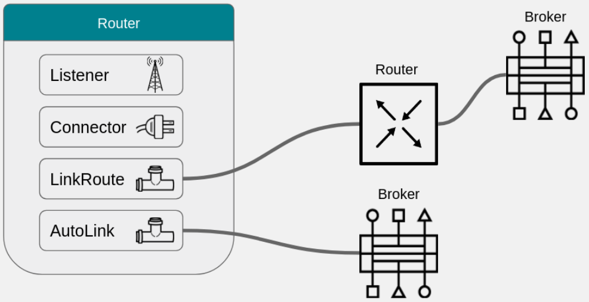
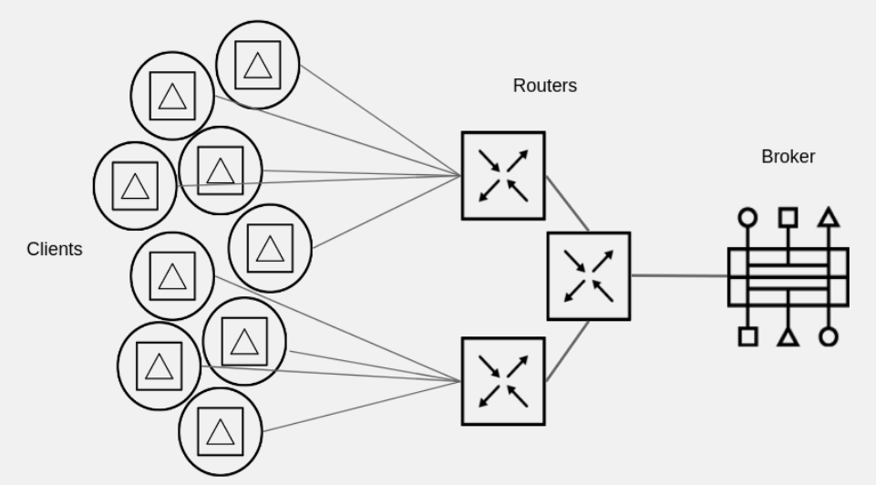
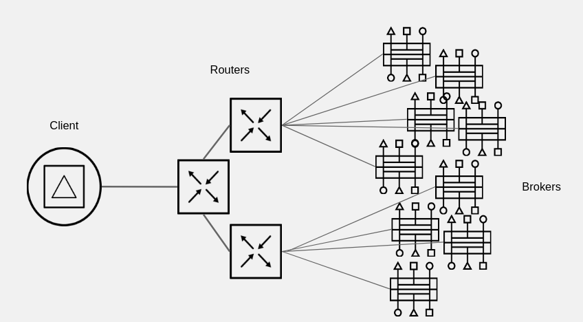
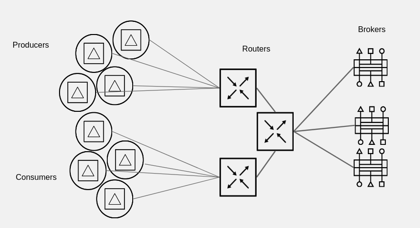
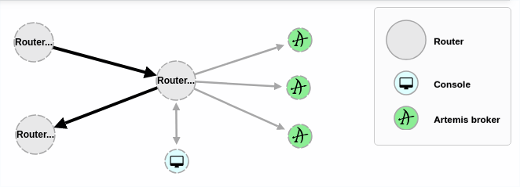
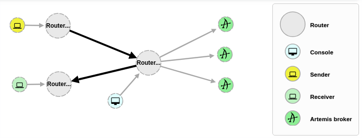
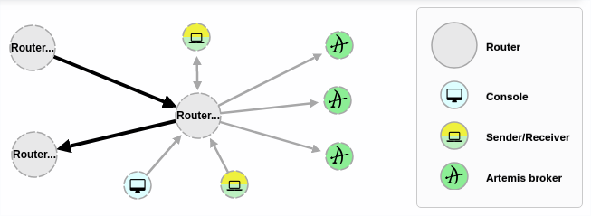

# Scale AMQ 7 with AMQ Interconnect

AMQ Interconnect provides flexible routing of messages between AMQP-enabled endpoints, including clients, brokers and
standalone services. With a single connection into a network of AMQ Interconnect routers, a client can exchange messages
with any other endpoint connected to the network.

AMQ Interconnect does not use master-slave clusters for high availability. It is typically deployed in topologies of
multiple routers with redundant network paths, which it uses to provide reliable connectivity. AMQ Interconnect can
distribute messaging workloads across the network and achieve new levels of scale with very low latency.

AMQ Interconnect is an application layer program running as a normal user program or as a daemon.

The router accepts AMQP connections from clients and creates AMQP connections to brokers or AMQP-based services. The
router classifies incoming AMQP messages and routes the messages between message producers and message consumers.

A messaging client can make a single AMQP connection into a messaging bus built with routers and over that connection,
exchange messages with one or more message brokers connected to any router in the network. At the same time the client
can exchange messages directly with other endpoints without involving a broker at all.

## Components

The following diagram shows the main components of AMQ Interconnect:

These components could be classified by:

* Connections: Listener, Connectors
* Addresses: AutoLink, LinkRoute

### Connections

AMQ Interconnect connects clients, servers, AMQP services and other routers through network connections.

* **Listener**: Accept client connections. A client connecting to a router listener uses the same methods that if would use
to connect to a broker. From the client’s perspective the router connection and link establishment are identical
to broker connection and link establishment.

There are different types of listeners:

* **normal**: The connection is used for AMQP clients using normal message delivery.
* **inter-router** : The connection is assumed to be to another router in the network. Inter-router discovery and
routing protocols can only be used over inter-router connections.
* **route-container**: The connection is a broker or other resource that holds known addresses. The router will
use this connection to create links as necessary. The addresses are available for routing only after the
remote resource has created a connection.

* **Connector**: The router can also be configured to create outbound connections to messaging brokers or
other AMQP entities using connectors. A connector is defined with the network address of the broker and the
name or names of the resources that are available in that broker. When a router connects to a broker through
a connector it uses the same methods a normal messaging client would use when connecting to the broker.

There are different types of connectors:

* **normal**: The connection is used for AMQP clients using normal message delivery. On this connector the router
will initiate the connection but it will never create any links. Links are to be created by the peer that accepts
the connection.
* **inter-router**: The connection is assumed to be to another router in the network. Inter-router discovery and
routing protocols can only be used over inter-router connections.
* **route-container**: The connection is to a broker or other resource that holds known addresses. The router will
use this connection to create links as necessary. The addresses are available for routing only after the router
has created a connection to the remote resource.

### Addresses 

AMQP addresses are used to control the flow of messages across a network of routers. Addresses are used in a
number of different places in the AMQP 1.0 protocol. They can be used in a specific message in the to and
reply-to fields of a message’s properties. They are also used during the creation of links in the address
field of a source or a target.

The router maintains several classes of address based on how the address is configured or discovered.

* Mobile (AutoLink): The address is a rendezvous point between senders and receivers. The router aggregates
and serializes messages from senders and distributes messages to receivers.
* Link Route (LinkRoute): The address defines a private messaging path between a sender and a receiver. The router
simply passes messages between the endpoints.

## Topology Samples

AMQ Interconnect will help to create different topologies to manage a high volume traffic or define an elastic
network in front of AMQ brokers.

In general these topology samples could resolve the following features:

* Large volume, High throughput
* Scale up broker vertically through interconnect routers
* Traffics automatically load balance among shards of brokers
* Freedom to add/remove shards without client noticing

## Connection Aggregation

This diagram shows an use case to manage unpredictable traffic at peak hours:

Clients will manage a lot of connections however the routers will manage less connections to the brokers 
deployed in the back-end. Routers will manage huge amount of connections instead of the final broker instances.

## Elastic Network

This diagram shows an AMQ Interconnect router forms an elastic network in front of brokers.

This topology will help us to modify the AMQ instances topology without any impact to the clients. We could add/remove
more brokers and the clients will manage the same connections.

# Topology Proposed

This repository will deploy the following topology to show some of the main AMQ interconnect capabilities: 

The routes deployed will be:

* **Aggregator Router**: Router to manage any connection from/to AMQ broker instances. This broker will aggregate any
connection from the other routers to the AMQ broker instances.
* **Producer Router**: Router to manage connections from the *Producer* applications.
* **Consumer Router**: Router to manage connections from the *Consumer* applications.

After finalize the configuration we could see from an AMQ Console the next topology deployed:

## Prerequisites

To deploy and test this topology you should have almost an AMQ 7 broker deployed and running on some host. 
If you have more instances, all of them should work in the same cluster definition.

**NOTE**: Because the routers are deployed in the same host as the brokers, AMQ Interconnect ports are increment
and different from the AMQP standard port (5672)

### AMQ 7 Queues

Samples will work with a set of queues that you should define in your AMQ 7 brokers. To do that, please,
add in *$AMQ_BROKER/etc/broker.xml* file the following address definitions at <addresses/> section:

	<address name="HelloWorld">
		<anycast>
			<queue name="HelloWorld"/>
		</anycast>
	</address>
	<address name="SampleQueue">
		<anycast>
			<queue name="SampleQueue" />
		</anycast>
	</address>
	<address name="RequestQueue">
		<anycast>
			<queue name="RequestQueue" />
		</anycast>
	</address>

## Installation

AMQ Interconnect is distributed as a set of RPM packages, which are available through your Red Hat subscription.

It is needed to enable the following repositories:

	$ sudo subscription-manager repos \
		--enable=amq-interconnect-1-for-rhel-7-server-rpms \
		--enable=a-mq-clients-1-for-rhel-7-server-rpms

The main packages to install are:

	$ sudo yum install qpid-dispatch-router qpid-dispatch-tools

If you plan to use SASL to authenticate connections, you must first add the SASL attributes to the router entity
in the router’s configuration file. These attributes define a set of SASL parameters that can be used by the
router’s incoming and outgoing connections. This means that the Cyrus SASL plugins should be installed for
each SASL mechanism you plan to use.

For example, you need the cyrus-sasl-plain plugin to use SASL PLAIN authentication.

	$ sudo yum install cyrus-sasl-plain

To see a list of Cyrus SASL plugins in Red Hat Enterprise Linux, use the *yum search cyrus-sasl* command. To
install a Cyrus SASL plugin, use the yum install PLUGIN command.

To start the router with the default configuration, do one of the following:

Run the router as a service in Red Hat Enterprise Linux 7:

	$ sudo systemctl start qdrouterd.service

Run the router as a daemon (or in foreground if you remove -d parameter):

	$ qdrouterd -d

AMQ Interconnect router configuration file is located at */etc/qpid-dispatch/qdrouterd.conf*. Any configuration 
will be defined in this file.

## Aggregator Router

This router will manage the incoming/outgoing messages from other routers to the AMQ 7 HA cluster topology behind it.

General Router definition:

	router {
		mode: interior
		id: Router.Aggregator
	}

**Listeners**: It will be three listeners defined to manage the different client connections:

* General listener for clients
* Inter-Router listener for other routers
* General listener to attend connections from AMQ 7 Management Web Console.

	# Listener for Clients
	listener {
		host: 0.0.0.0
		port: 5772
		authenticatePeer: no
		saslMechanisms: ANONYMOUS
	}
	
	# Listener for Inter-Router connections
	listener {
		host: 0.0.0.0
		port: 5773
		authenticatePeer: no
		role: inter-router
	}
	
	# Listener for AMQ Console
	listener {
		name: amq-console
		role: normal
		host: 0.0.0.0
		port: 5673
		http: yes
	}

**Connectors**: This section will define the connectors for each AMQ 7 broker defined in the back-end. 

	connector {
		name: amq7.master.rhel7jboss01
		host: rhel7jboss01
		port: 5672
		role: route-container
		saslMechanisms: ANONYMOUS
	}
	
	connector {
		name: amq7.master.rhel7jboss02
		host: rhel7jboss02
		port: 5672
		role: route-container
		saslMechanisms: ANONOYMOUS
	}
	
	connector {
		name: amq7.master.rhel7jboss03
		host: rhel7jboss03
		port: 5672
		role: route-container
		saslMechanisms: ANONYMOUS
	}

**Addresses**: This sample will define an address for SampleQueue to the different brokers defined in the
connectors section.

	address {
		prefix: SampleQueue
		# Routing messages through a broker queue
		waypoint: yes
	}

A waypoint address identifies a queue on a broker to route messages.

Now we define the auto links between the address and the different back-ends. This case represents a sharded queue because there are
multiple brokers. Using queue sharding, it is possible to distribute a single queue over multiple brokers. 

*autoLinks* will connect the router to the broker. Autolinks will handled the client traffic on the router, not the broker. Clients attach
their links to the router and then the router uses internal autolinks to connect to the queue on the broker. This means that the queue will
always have a single producer and consumer regardless of how many clients are attached to the router.

These blocks will define the links to send messages to the brokers from the router:

	autoLink {
		addr: SampleQueue
		connection: amq7.master.rhel7jboss01
		dir: out
	}
	
	autoLink {
		addr: SampleQueue
		connection: amq7.master.rhel7jboss02
		dir: out
	}
	
	autoLink {
		addr: SampleQueue
		connection: amq7.master.rhel7jboss03
		dir: out
	}

These blocks will define the links to receive messages from the brokers into the router:

	autoLink {
		addr: SampleQueue
		connection: amq7.master.rhel7jboss01
		dir: in
	}
	
	autoLink {
		addr: SampleQueue
		connection: amq7.master.rhel7jboss02
		dir: in
	}
	
	autoLink {
		addr: SampleQueue
		connection: amq7.master.rhel7jboss03
		dir: in
	}

**NOTE**: Documented only one queue. To test all cases you should add the other queues (HelloWorld, RequestQueue)

## Producer Router

This router will manage the incoming messages from producers to Aggregator Router.

General Router definition:

	router {
		mode: interior
		id: Router.Producer
	}

**Listeners**: It will be two listeners defined to manage the different client connections:

* General listener for clients
* Inter-Router listener for other routers

	# Listener for Clients
	listener {
		host: 0.0.0.0
		port: 5772
		authenticatePeer: no
		saslMechanisms: ANONYMOUS
	}
	
	# Listener for Inter-Router connections
	listener {
		host: 0.0.0.0
		port: 5773
		authenticatePeer: no
		role: inter-router
	}

**Connectors**: This section will define the connectors for the Aggregator router. 

	connector {
		name: Router.Aggregator
		host: rhel7jboss02
		port: 5773
		role: inter-router
	}

**Addresses**: This sample will define an address for SampleQueue to distribute the messages between the differente routers in the network.

	address {
		prefix: SampleQueue
		distribution: closest
	}

This address define a route pattern based in closest method. This method determines the shortest path based on the topology cost to reach each of the consumers. 

**NOTE**: Documented only one queue. To test all cases you should add the other queues (HelloWorld, RequestQueue)

## Consumer Router

This router will manage the outgoing messages from Aggregator Router to the Consumer Router.

General Router definition:

	router {
		mode: interior
		id: Router.Consumer
	}

**Listeners**: It will be two listeners defined to manage the different client connections:

* General listener for clients
* Inter-Router listener for other routers

	# Listener for Clients
	listener {
		host: 0.0.0.0
		port: 5772
		authenticatePeer: no
		saslMechanisms: ANONYMOUS
	}
	
	# Listener for Inter-Router connections
	listener {
		host: 0.0.0.0
		port: 5773
		authenticatePeer: no
		role: inter-router
	}

**Connectors**: This section will define the connectors to the Aggregator Router. 

	connector {
		name: Router.Aggregator
		host: rhel7jboss02
		port: 5773
		role: inter-router
	}

**Addresses**: This sample will define an address for SampleQueue to distribute the messages between the different routers in the network.

	address {
		prefix: SampleQueue
		waypoint: yes
	}

**NOTE**: Documented only one queue. To test all cases you should add the other queues (HelloWorld, RequestQueue)

## Monitoring AMQ Interconnect

AMQ Interconnect has a command to monitor and analyze how is the router is working.

	$ qdstat -b 127.0.0.1:5772 <commands>

**NOTE**: -b parameter should be needed if you use different ports from AMQP standard (5672)

General Information:

	$ qdstat -b 127.0.0.1:5772 -g
	Router Statistics
	  attr         value
	  =========================================================================
	  Version      Red Hat JBoss AMQ Interconnect 1.1.0 (qpid-dispatch 1.0.0)
	  Mode         interior
	  Area         0
	  Router Id    Router.Producers
	  Link Routes  0
	  Auto Links   0
	  Links        6
	  Nodes        2
	  Addresses    13
	  Connections  2

Connections:

	$ qdstat -b 127.0.0.1:5772 -c
	Connections
	  id  host               container                             role          dir  security     authentication  tenant
	  =====================================================================================================================
	  1   rhel7jboss02:5773  Router.Aggregator                     inter-router  out  no-security  anonymous-user  
	  21  127.0.0.1:43852    0f247615-e8ef-4750-8641-7a5e105076c6  normal        in   no-security  no-auth         

AutoLinks:

	$ qdstat -b 127.0.0.1:5772 --autolinks
	AutoLinks
	  addr          dir  phs  extAddr  link  status    lastErr
	  ==========================================================
	  RequestQueue  out  0             62    active    
	  RequestQueue  in   1             63    active    
	  SampleQueue   out  0             23    active    
	  SampleQueue   out  0             21    active    
	  SampleQueue   out  0             60    active    
	  SampleQueue   out  0                   inactive  
	  SampleQueue   in   1             24    active    
	  SampleQueue   in   1             22    active    
	  SampleQueue   in   1             61    active    
	  SampleQueue   in   1                   inactive  

# Testing

## Configuring Maven

To run the examples from the binary release zip, it is first necessary to configure Maven to utilise the provided 
repository files for the client. This is done by updating the Maven settings.xml file. 

Example configuration can be found in the [configuration/settings.xml](./configuration/settings.xml) file.

## Build Examples

Use Maven to build the module, and additionally copy the dependencies alongside their output:

	mvn -s configuration/settings.xml clean package \
		dependency:copy-dependencies -DincludeScope=runtime -DskipTests

Now you can run the examples using commands of the format:

* Command for *Linux* platforms: 

	java -cp "target/classes/:target/dependency/*" \
		org.apache.qpid.jms.example.<example>.<MAIN_CLASS_EXAMPLE_NAME>

* Command for *Windows* platforms: 

	java -cp "target\classes\;target\dependency\*" \
		org.apache.qpid.jms.example.<example>.<MAIN_CLASS_EXAMPLE_NAME>

**NOTE**: By default the examples can only connect anonymously. A username and
password with which the connection can authenticate with the server may be set
through system properties named USER and PASSWORD respectively. E.g:

* Command for *Linux* platforms:   

	java -DUSER=guest -DPASSWORD=guest -cp "target/classes/:target/dependency/*" \
		org.apache.qpid.jms.example.<example>.<MAIN_CLASS_EXAMPLE_NAME>

* Command for *Windows* platforms: 

	java -DUSER=guest -DPASSWORD=guest -cp "target\classes\;target\dependency\*" \
		org.apache.qpid.jms.example.<example>.<MAIN_CLASS_EXAMPLE_NAME>

**NOTE**: You can configure the connection and queue details used by updating the JNDI configuration file before 
building. It can be found at: [src/main/resources/jndi.properties](src/main/resources/jndi.properties)

# Examples

## Hello World

This sample will show you 

From one terminal starts the example:

	java -DUSER=application -DPASSWORD=application -cp "target/classes/:target/dependency/*" \
		org.apache.qpid.jms.example.HelloWorld

## Publish - Subscribe

* *Sender*: Execute from one terminal to send messages.

	java -DUSER=application -DPASSWORD=application -cp "target/classes/:target/dependency/*" \
		org.apache.qpid.jms.example.pubsub.Sender

* *Receiver*: Execute from other terminal to get messages.

	java -DUSER=application -DPASSWORD=application -cp "target/classes/:target/dependency/*" \
		org.apache.qpid.jms.example.pubsub.Receiver

## Request - Response

* *Server*: Execute from one terminal to process messages.

	java -DUSER=application -DPASSWORD=application -cp "target/classes/:target/dependency/*" \
		org.apache.qpid.jms.example.reqres.Server

* *Client*: Execute from another terminal to send messages.

	java -DUSER=application -DPASSWORD=application -cp "target/classes/:target/dependency/*" \
		org.apache.qpid.jms.example.reqres.Client

# Main References

To get more details, review the following links:  

* [Using AMQ Interconnect](https://access.redhat.com/documentation/en-us/red_hat_amq/7.1/html-single/using_amq_interconnect/index)
* [Apache Qpid Distach Router](https://qpid.apache.org/components/dispatch-router/index.html)
